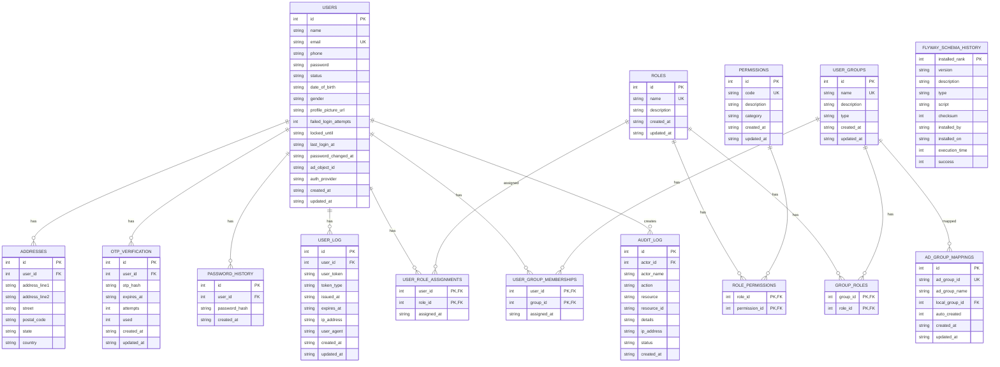

# java-react-auth-platform

Enterprise authentication and RBAC platform — JWT auth service with Keycloak/LDAP SSO, role-based access control, OTP verification, and a React admin frontend.

---

## Stack

| Layer | Technology |
|---|---|
| Backend | Java 21, Spring Boot 3, PostgreSQL, Redis, Flyway |
| Auth | JWT (HS512), Spring Security 6, Spring LDAP |
| SSO | Keycloak (dev) / Keycloak (prod), OIDC + PKCE |
| Async | AWS SQS + SES (LocalStack in dev) |
| Frontend | React 19, Vite, TailwindCSS, Axios |
| Infrastructure | Docker Compose, Kubernetes (k8s/) |

---

## Project Structure

```
fp-be/
├── auth-be/            # Spring Boot auth service (port 8080)
├── auth-fe/            # React admin frontend (port 5173)
├── k8s/                # Kubernetes manifests
├── docker-compose.yml  # Local infrastructure
└── README.md
```

---

## Prerequisites

- Java 21
- Maven 3.9+
- Node.js 20+
- Docker Desktop
- AWS CLI (for LocalStack SES setup)

---

## 1. Start Infrastructure

```bash
docker compose up -d
```

| Service | URL / Host | Credentials |
|---|---|---|
| PostgreSQL (auth) | `localhost:5433` | `admin / admin` |
| PostgreSQL (product) | `localhost:5434` | `admin / admin` |
| Redis | `localhost:6379` | — |
| pgAdmin | http://localhost:5050 | `admin@example.com / admin` |
| Keycloak | http://localhost:8180 | `admin / admin` |
| OpenLDAP | `localhost:389` | `cn=admin,dc=corp,dc=example,dc=com / admin` |
| phpLDAPadmin | http://localhost:6443 | same as OpenLDAP |

---

## 2. LocalStack Setup (one-time per container start)

LocalStack resets verified SES identities on every restart. After `docker compose up -d`:

```bash
aws --endpoint-url=http://localhost:4566 ses verify-email-identity \
  --email-address noreply@shop.com --region us-east-1
```

> OTP emails will fail with `MessageRejectedException` if this step is skipped or after a LocalStack container restart.

---

## 3. Keycloak Setup (one-time)

> Realm data persists across restarts via `dev-file` storage.

1. Open http://localhost:8180 → log in as `admin / admin`
2. **Create realm** → name: `corporate`
3. **Clients** → **Create client** → ID: `fp-auth-client` → enable **Direct access grants**
   - Valid redirect URIs: `http://localhost:5173/*`, `http://localhost:5174/*`
   - Web origins: `http://localhost:5173`
4. **Create test users** (Users → Add user → set email as username → Email verified ON → set password, Temporary OFF):

| Email | Password |
|---|---|
| `alice@corp.example.com` | `Alice@Pass1!` |
| `bob@corp.example.com` | `Bob@Pass1!` |
| `carol@corp.example.com` | `Carol@Pass1!` |

> `carol` is pre-seeded in `GRP-SYSTEM-ADMINS` (LDAP bootstrap) and maps to `SYSTEM_ADMIN` group via Flyway migration `V19`.

---

## 4. Start the Backend

```bash
cd auth
mvn spring-boot:run
```

| Endpoint | URL |
|---|---|
| API base | http://localhost:8080 |
| Swagger UI | http://localhost:8080/swagger-ui.html |

---

## 5. Start the Frontend

```bash
cd auth-fe
npm install
npm run dev
```

App: http://localhost:5173

---

## 6. Granting Admin Access

Admin pages require RBAC permissions delivered through groups. The hierarchy is:

```
Users → Groups → Roles → Permissions
```

AD users' group memberships are managed in LDAP/Keycloak. Local users are assigned groups via the admin UI or API.

### AD user (Keycloak/LDAP)

`carol` is already in `GRP-SYSTEM-ADMINS` → maps to `SYSTEM_ADMIN` group → gets `ROLE_SYSTEM_ADMIN`. Log in via `POST /auth/ad/login` with a Keycloak `id_token`.

To add another user, add them to `GRP-SYSTEM-ADMINS` in OpenLDAP via phpLDAPadmin (http://localhost:6443) and create a matching Keycloak account.

### Local user

Assign the user to `SYSTEM_ADMIN` (or `SUPER_ADMIN`) via SQL:

```sql
INSERT INTO user_group_memberships (user_id, group_id)
SELECT u.id, g.id FROM users u
JOIN user_groups g ON g.name = 'SYSTEM_ADMIN'
WHERE u.email = 'youruser@example.com';
```

Or use the admin UI: **Users → assign group**.

### Group → permission mapping

| Group | Role | Key permissions |
|---|---|---|
| `SYSTEM_ADMIN` | `ROLE_SYSTEM_ADMIN` | `DASHBOARD_VIEW`, `USER_GROUPS_MANAGE`, `GROUP_MANAGE`, `ROLE_MANAGE`, `PERMISSION_MANAGE`, `AUDIT_LOG_VIEW`, `SYSTEM_CONFIG_VIEW` |
| `SUPER_ADMIN` | `ROLE_SUPER_ADMIN` | all permissions |
| `RETAIL_CUSTOMER` | `ROLE_CUSTOMER_BASIC` | `ACCOUNT_VIEW`, `TRANSACTION_VIEW` |

---

## 7. Environment Variables

Backend — sensible defaults for local dev; no `.env` file required.

| Variable | Default | Description |
|---|---|---|
| `JWT_SECRET` | (dev key) | Min 32-byte secret — **change in production** |
| `AD_ENABLED` | `true` | Enable AD/OIDC login |
| `AD_LDAP_PASSWORD` | `admin` | LDAP bind password (use `svc-ldap` in prod) |
| `CORS_ALLOWED_ORIGINS` | `localhost:5173,5174` | Frontend origins |
| `REDIS_HOST` | `localhost` | Redis host |
| `AWS_ENDPOINT` | `http://localhost:4566` | LocalStack endpoint (blank = real AWS) |

Frontend — `auth-fe/.env`:

```properties
VITE_API_BASE_URL=http://localhost:8080
VITE_KEYCLOAK_URL=http://localhost:8180
VITE_KEYCLOAK_REALM=corporate
VITE_KEYCLOAK_CLIENT_ID=fp-auth-client
VITE_AUDIT_PAGE_SIZE=10
```

---

## 8. Useful Commands

```bash
# Stop all services
docker compose down

# Reset OpenLDAP (re-seeds bootstrap.ldif on next start)
docker compose rm -sf openldap && docker compose up -d openldap

# Wipe Keycloak data and start fresh
docker compose rm -sf keycloak && docker volume rm fp-be_keycloak_data && docker compose up -d keycloak

# Re-verify SES sender after LocalStack restart
aws --endpoint-url=http://localhost:4566 ses verify-email-identity \
  --email-address noreply@shop.com --region us-east-1

# View backend logs
docker compose logs -f auth-db

# Run backend tests
cd auth && mvn test
```

---

## 9. Database Schema (ERD)



---

## 10. Production Checklist

- [ ] Set `JWT_SECRET` to a cryptographically random ≥ 32-byte value (Vault / KMS)
- [ ] Set `AD_LDAP_USER_DN` / `AD_LDAP_PASSWORD` to the `svc-ldap` service account from secrets manager
- [ ] Set `CORS_ALLOWED_ORIGINS` to exact production frontend URL
- [ ] Set `AWS_ENDPOINT` to blank (uses real AWS SQS / SES)
- [ ] Replace Keycloak with Keycloak — update `AD_JWKS_URI`, `AD_ISSUER`, `AD_AUDIENCE`
- [ ] Use LDAPS (`ldaps://`) for LDAP
- [ ] Enable HTTPS at load balancer / ingress
- [ ] Disable SQL debug logging (`application-prod.properties`)
