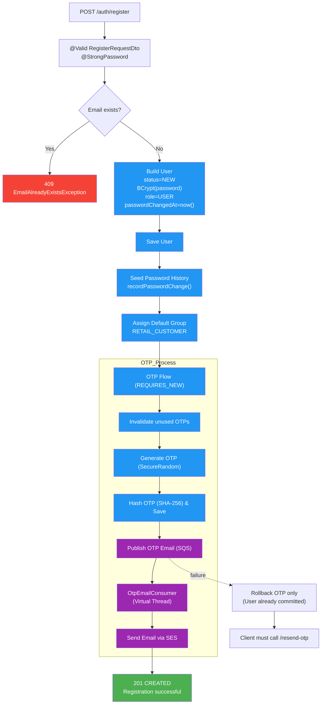
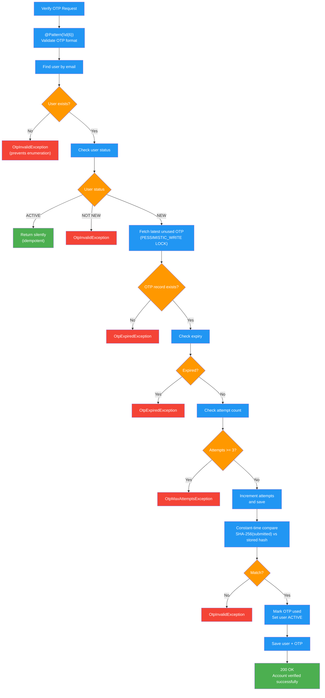
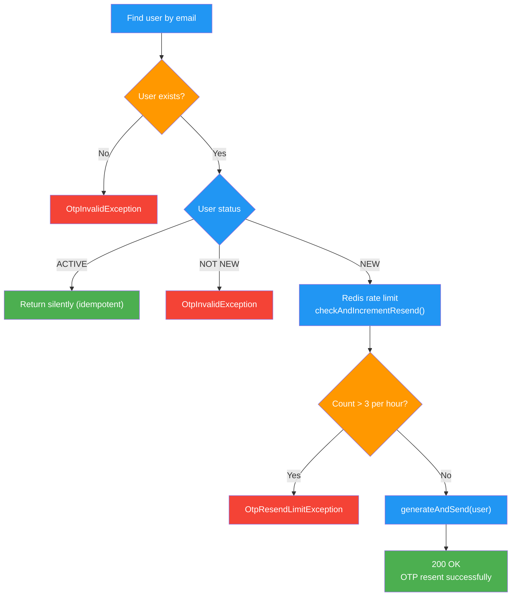
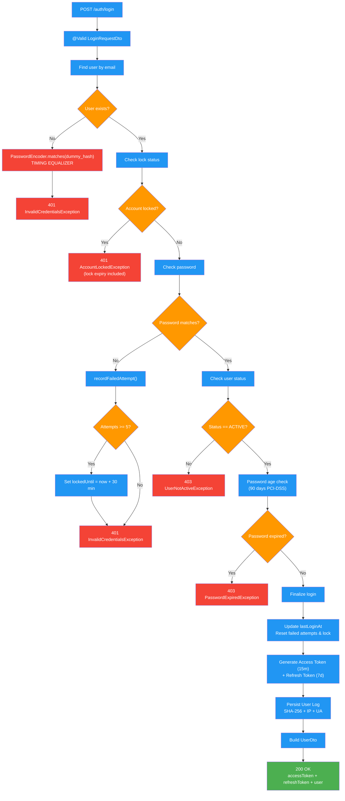

# Auth Service — Full Implementation Reference

> **Project:** fp-be / auth microservice
> **Stack:** Java 21 · Spring Boot 4.0.6 · PostgreSQL · Flyway · JWT (jjwt 0.12.x) · Spring Mail · Spring Security 6 · Redis 7 · AWS SDK v2 (SQS + SES)
> **Last updated:** 2026-05-03

---

## Table of Contents

1. [Architecture Overview](#1-architecture-overview)
2. [Database Schema](#2-database-schema)
3. [API Endpoints](#3-api-endpoints)
4. [Registration Flow](#4-registration-flow)
5. [OTP Verification Flow](#5-otp-verification-flow)
6. [Login Flow](#6-login-flow)
7. [Token Flows](#7-token-flows)
8. [Password Management Flows](#8-password-management-flows)
9. [JWT Design](#9-jwt-design)
10. [RBAC Model](#10-rbac-model)
11. [Security Controls — Banking Standards Audit](#11-security-controls--banking-standards-audit)
12. [Exception Model](#12-exception-model)
13. [Configuration Reference](#13-configuration-reference)
14. [File Map](#14-file-map)
15. [Test Coverage](#15-test-coverage)
16. [Known Gaps & Future Work](#16-known-gaps--future-work)

---

## 1. Architecture Overview

```mermaid
flowchart TD

%% ========== Client & Security ==========
Client --> JwtAuthenticationFilter

JwtAuthenticationFilter["JwtAuthenticationFilter\n- Sig & Expiry\n- Token Type\n- JTI Blacklist\n- User-level Invalidation\n- UserPrincipal"]

class JwtAuthenticationFilter security

%% ========== Controllers ==========
JwtAuthenticationFilter --> AuthController
JwtAuthenticationFilter --> AdminController

AuthController["AuthController\nPOST /auth/**"]
AdminController["AdminController\nGET|POST|DELETE /admin/**"]

class AuthController,AdminController controller

%% ========== Auth Service ==========
AuthController --> AuthService
AdminController --> AuthService

subgraph Auth_Layer
  AuthService["AuthService / Impl\nregister | login | OTP | refresh | logout | password flows"]
end

class AuthService service

%% ========== OTP ==========
subgraph OTP_Module
  OtpService["OtpService"]
  OtpRepo["OtpVerificationRepository\n(JPA + locks)"]
  UserRepo["UserRepository"]
  OtpPublisher["OtpEmailPublisher (SQS)"]
  OtpRateLimit["OtpRateLimit (Redis)"]

  OtpService --> OtpRepo
  OtpService --> UserRepo
  OtpService --> OtpPublisher
  OtpService --> OtpRateLimit
end

class OtpService service
class OtpRepo,UserRepo repository
class OtpPublisher async
class OtpRateLimit cache

%% ========== Token ==========
subgraph Token_Management
  JwtService["JwtService"]
  TokenBlacklist["TokenBlacklistService"]
  Redis["Redis\nblacklist + user invalidation"]

  TokenBlacklist --> Redis
end

class JwtService,TokenBlacklist service
class Redis cache

%% ========== Password ==========
subgraph Password_Policy
  PasswordPolicy["PasswordPolicyService"]
  PasswordHistoryRepo["PasswordHistoryRepository"]

  PasswordPolicy --> PasswordHistoryRepo
end

class PasswordPolicy service
class PasswordHistoryRepo repository

%% ========== Email ==========
subgraph Email
  EmailService["EmailService (SMTP)"]
end

class EmailService service

%% ========== Persistence ==========
subgraph Persistence
  UserLogRepo["UserLogRepository"]
  UserGroupRepo["UserGroupRepository"]
  PasswordEncoder["PasswordEncoder"]
end

class UserLogRepo,UserGroupRepo repository
class PasswordEncoder util

%% ========== Wiring ==========
AuthService --> OtpService
AuthService --> JwtService
AuthService --> TokenBlacklist
AuthService --> PasswordPolicy
AuthService --> EmailService
AuthService --> UserRepo
AuthService --> UserLogRepo
AuthService --> UserGroupRepo
AuthService --> PasswordEncoder

%% ========== Async ==========
subgraph Async_Processing
  OtpConsumer["OtpEmailConsumer\nVirtual Threads\nSQS long poll"]
  SES["AWS SES"]

  OtpConsumer --> SES
end

OtpPublisher --> OtpConsumer

class OtpConsumer async
class SES external

%% ========== Admin ==========
subgraph Authorization
  PermissionService["PermissionService"]
  RoleService["BankingRoleService"]
  GroupService["UserGroupService"]
end

AdminController --> PermissionService
AdminController --> RoleService
AdminController --> GroupService

class PermissionService,RoleService,GroupService service

%% ========== Exception ==========
GlobalExceptionHandler["GlobalExceptionHandler"]

AuthController --> GlobalExceptionHandler
AdminController --> GlobalExceptionHandler

class GlobalExceptionHandler util

%% ========== Styles ==========
classDef controller fill:#4CAF50,stroke:#2E7D32,color:#fff
classDef service fill:#2196F3,stroke:#1565C0,color:#fff
classDef repository fill:#FF9800,stroke:#E65100,color:#fff
classDef async fill:#9C27B0,stroke:#6A1B9A,color:#fff
classDef cache fill:#00BCD4,stroke:#00838F,color:#fff
classDef security fill:#F44336,stroke:#B71C1C,color:#fff
classDef util fill:#607D8B,stroke:#37474F,color:#fff
classDef external fill:#795548,stroke:#3E2723,color:#fff
```



All business exceptions extend `BusinessException` which carries an `HttpStatus`.
`GlobalExceptionHandler` translates them into a uniform `ResponseDto<Void>` JSON body.

---

## 2. Database Schema

### Flyway Migration Sequence

| Version | File | Purpose |
|---------|------|---------|
| V1 | `V1__create_users_table.sql` | Core users table |
| V2 | `V2__create_address_table.sql` | One-to-many addresses per user |
| V3 | `V3__create_user_log_table.sql` | Token audit log (initial) |
| V4 | `V4__add_role_to_users.sql` | ROLE enum column |
| V5 | `V5__enhance_user_log_table.sql` | Token type, issued_at, expires_at |
| V6 | `V6__add_lockout_to_users.sql` | Brute-force lockout columns |
| V7 | `V7__create_otp_verification_table.sql` | OTP records |
| V8 | `V8__add_otp_verification_indexes.sql` | Performance indexes for OTP queries |
| V9 | `V9__add_user_profile_fields.sql` | Optional profile columns on users table |
| V10 | `V10__create_rbac_tables.sql` | RBAC schema: 7 new tables + 4 indexes |
| V11 | `V11__seed_rbac_banking_data.sql` | 32 permissions, 12 roles, 13 groups + role→permission + group→role mappings |
| V12 | `V12__backfill_user_groups.sql` | Assigns existing USER accounts → RETAIL_CUSTOMER; ADMIN accounts → SYSTEM_ADMIN |
| V13 | `V13__create_password_history_table.sql` | Password history table (BCrypt hashes, last 12) |
| V14 | `V14__add_password_changed_at_to_users.sql` | `password_changed_at` timestamp on users (PCI-DSS 8.3.9) |
| V15 | `V15__add_audit_fields_to_user_log.sql` | `ip_address`, `user_agent` on user_log (PCI-DSS 10.2.4/10.2.7) |

### `users` Table

```sql
id                    BIGSERIAL     PRIMARY KEY
name                  VARCHAR(255)  NOT NULL
email                 VARCHAR(255)  NOT NULL UNIQUE
phone                 VARCHAR(50)
password              VARCHAR(255)  NOT NULL        -- BCrypt hash, never plaintext
status                VARCHAR(50)   NOT NULL        -- NEW | ACTIVE | INACTIVE | DELETED
role                  VARCHAR(50)                   -- USER | ADMIN  (DEPRECATED — superseded by RBAC groups)
failed_login_attempts INT           NOT NULL DEFAULT 0
locked_until          TIMESTAMP     NULL            -- NULL = not locked
password_changed_at   TIMESTAMP     NOT NULL        -- V14: set on register + every password change
-- Optional profile fields (V9) — all nullable
date_of_birth         DATE          NULL
gender                VARCHAR(50)   NULL            -- MALE | FEMALE | OTHER | PREFER_NOT_TO_SAY
profile_picture_url   VARCHAR(1024) NULL
last_login_at         TIMESTAMP     NULL            -- updated on every successful login
created_at            TIMESTAMP     NOT NULL
updated_at            TIMESTAMP     NOT NULL
```

### `password_history` Table (V13)

Stores BCrypt hashes of previous passwords per user. Never stores plaintext.

```sql
id             BIGSERIAL    PRIMARY KEY
user_id        BIGINT       NOT NULL REFERENCES users(id) ON DELETE CASCADE
password_hash  VARCHAR(60)  NOT NULL    -- BCrypt hash (always 60 chars)
created_at     TIMESTAMP    NOT NULL DEFAULT CURRENT_TIMESTAMP

INDEX idx_password_history_user_created ON (user_id, created_at DESC)
```

### RBAC Tables (V10)

```sql
-- permissions: atomic operation codes (e.g. ACCOUNT_VIEW, TRANSACTION_INITIATE)
permissions (id, code UNIQUE, description, category, created_at, updated_at)

-- banking_roles: named role definitions (e.g. ROLE_TELLER, ROLE_CUSTOMER_BASIC)
banking_roles (id, name UNIQUE, description, created_at, updated_at)

-- role_permissions: M:M — which permissions a role carries
role_permissions (role_id FK → banking_roles, permission_id FK → permissions)

-- user_groups: group definitions (e.g. RETAIL_CUSTOMER, BANK_TELLER)
user_groups (id, name UNIQUE, description, type, created_at, updated_at)
-- type: CUSTOMER | STAFF | OVERSIGHT | ADMIN

-- group_roles: M:M — roles assigned to a group
group_roles (group_id FK → user_groups, role_id FK → banking_roles)

-- user_group_memberships: M:M — which groups a user belongs to
user_group_memberships (user_id FK → users, group_id FK → user_groups, assigned_at)

-- user_role_assignments: M:M — direct role assignment (bypasses groups; for special cases)
user_role_assignments (user_id FK → users, role_id FK → banking_roles, assigned_at)
```

**Performance indexes (V10):** `idx_role_permissions_role`, `idx_group_roles_group`, `idx_user_group_user`, `idx_user_role_user`.

### `otp_verification` Table

```sql
id          BIGSERIAL PRIMARY KEY
user_id     BIGINT       NOT NULL REFERENCES users(id) ON DELETE CASCADE
otp_hash    VARCHAR(64)  NOT NULL    -- SHA-256 hex of the raw OTP; never the raw value
expires_at  TIMESTAMP    NOT NULL
attempts    INT          NOT NULL DEFAULT 0
used        BOOLEAN      NOT NULL DEFAULT FALSE
created_at  TIMESTAMP    NOT NULL DEFAULT NOW()
updated_at  TIMESTAMP    NOT NULL DEFAULT NOW()
```

**Indexes:**

```sql
idx_otp_user_id      ON otp_verification(user_id)
idx_otp_user_created ON otp_verification(user_id, created_at)             -- resend rate-limit query
idx_otp_user_unused  ON otp_verification(user_id, created_at DESC)
                     WHERE used = false                                    -- verify hot path
```

### `user_log` Table

Stores SHA-256 hashes of issued JWT tokens for audit purposes. Raw tokens are never persisted.

```sql
id          BIGSERIAL   PRIMARY KEY
user_id     BIGINT      NOT NULL REFERENCES users(id)
user_token  VARCHAR(512) NOT NULL   -- SHA-256 hex of raw token
token_type  VARCHAR(20)  NOT NULL   -- ACCESS | REFRESH
issued_at   TIMESTAMP    NOT NULL
expires_at  TIMESTAMP    NOT NULL
ip_address  VARCHAR(45)  NULL       -- V15: IPv4 or IPv6; honours X-Forwarded-For (PCI-DSS 10.2.4)
user_agent  VARCHAR(512) NULL       -- V15: HTTP User-Agent string (PCI-DSS 10.2.7)
created_at  TIMESTAMP    NOT NULL
updated_at  TIMESTAMP    NOT NULL
```

### Redis Key Space

| Key Pattern | Value | TTL | Purpose |
|---|---|---|---|
| `blacklist:jti:<jti>` | `"1"` | Token remaining lifetime | Per-token revocation (logout, rotation) |
| `user:tokens:invalidated:<userId>` | epoch seconds | Refresh token lifetime (7 days) | User-level session invalidation (password change/reset) |
| `otp:resend:<userId>` | counter string | 1 hour | OTP resend rate limiting |
| `reset:token:<sha256(token)>` | userId string | 15 minutes | Password reset token (single-use) |

---

## 3. API Endpoints

### Public — `/auth/**` (no token required)

| Method | Path | Status | Description |
|--------|------|--------|-------------|
| `POST` | `/auth/register` | 201 | Register user; OTP emailed via SQS/SES |
| `POST` | `/auth/verify-otp` | 200 | Verify OTP; account → ACTIVE |
| `POST` | `/auth/resend-otp` | 200 | Resend OTP (max 3/hour; Redis rate-limited) |
| `POST` | `/auth/login` | 200 | Authenticate; return JWT pair + UserDto |
| `POST` | `/auth/refresh` | 200 | Exchange refresh token for new token pair (rotation) |
| `POST` | `/auth/forgot-password` | 200 | Send password reset email (always 200 — no enumeration) |
| `POST` | `/auth/reset-password` | 200 | Reset password using single-use token from email |

### Protected — `/auth/**` (valid ACCESS token required)

| Method | Path | Status | Description |
|--------|------|--------|-------------|
| `POST` | `/auth/logout` | 200 | Revoke access + refresh token JTIs in Redis |
| `POST` | `/auth/change-password` | 200 | Change password; invalidates all sessions on all devices |

### Admin — `/admin/**` (valid ACCESS token + `@PreAuthorize`)

| Method | Path | Permission | Description |
|--------|------|-----------|-------------|
| `GET` | `/admin/permissions` | `PERMISSION_MANAGE` | List all permissions |
| `GET` | `/admin/roles` | `ROLE_MANAGE` | List all roles with permissions |
| `GET` | `/admin/roles/{id}` | `ROLE_MANAGE` | Get role detail |
| `POST` | `/admin/roles/{id}/permissions` | `PERMISSION_MANAGE` | Assign permission to role |
| `DELETE` | `/admin/roles/{id}/permissions/{pid}` | `PERMISSION_MANAGE` | Remove permission from role → 204 |
| `GET` | `/admin/groups` | `GROUP_MANAGE` | List all groups |
| `GET` | `/admin/groups/{id}` | `GROUP_MANAGE` | Get group detail with roles |
| `POST` | `/admin/groups/{id}/roles` | `GROUP_MANAGE` | Assign role to group |
| `DELETE` | `/admin/groups/{id}/roles/{rid}` | `GROUP_MANAGE` | Remove role from group → 204 |
| `GET` | `/admin/users/{userId}/groups` | `USER_GROUPS_MANAGE` | Get user's group memberships |
| `POST` | `/admin/users/{userId}/groups` | `USER_GROUPS_MANAGE` | Add user to a group |
| `DELETE` | `/admin/users/{userId}/groups/{groupId}` | `USER_GROUPS_MANAGE` | Remove user from a group → 204 |
| `GET` | `/admin/users/{userId}/permissions` | `USER_GROUPS_MANAGE` | Get user's effective permission set |

All assign operations are **idempotent** — no error if already assigned. All remove operations are **idempotent** — no error if not present.

### `POST /auth/register` — Request Body

```json
{
  "name": "John Doe",
  "email": "john.doe@example.com",
  "phone": "+1234567890",
  "password": "Secure@Pass1!",
  "role": "USER",
  "addresses": [
    {
      "addressLine1": "123 Main St",
      "street": "Main Street",
      "postalCode": "10001",
      "state": "NY",
      "country": "USA"
    }
  ]
}
```

> **Password rules (PCI-DSS 8.3.6 / NIST 800-63B):** 12–128 characters, at least one uppercase, one lowercase, one digit, one special character. Enforced by `@StrongPassword` custom annotation on the DTO.

**Responses:** `201 Created` | `400 Bad Request` (validation) | `409 Conflict` (duplicate email)

### `POST /auth/login` — Success Response

```json
{
  "accessToken":  "<JWT>",
  "refreshToken": "<JWT>",
  "user": { ... }
}
```

**Responses:** `200 OK` | `400` (validation) | `401` (wrong credentials / locked) | `403` (account not ACTIVE / password expired)

---

## 4. Registration Flow



---

## 5. OTP Verification Flow

### 5.1 Verify (`POST /auth/verify-otp`)



### 5.2 Resend (`POST /auth/resend-otp`)



---

## 6. Login Flow

```
POST /auth/login
        │
        ▼
  [Validation]  @Valid on LoginRequestDto
        │
        ▼
  Step 1: userRepository.findByEmail(username)
        │  ── not found ──► passwordEncoder.matches(dummy_hash) [TIMING EQUALIZER]
        │                    ──► 401 InvalidCredentialsException
        │
        ▼
  Step 2: [Lockout check] user.lockedUntil != null && now.isBefore(lockedUntil)
        │  ── locked ──► 401 AccountLockedException (message includes lock expiry)
        │
        ▼
  Step 3: [Password check] passwordEncoder.matches(request.password, user.password)
        │  ── mismatch ──► recordFailedAttempt(user)
        │                    [if attempts >= 5: lockedUntil = now + 30 min]
        │                    ──► 401 InvalidCredentialsException
        │
        ▼
  Step 4: [Status check] user.status != ACTIVE
        │  ── not active ──► 403 UserNotActiveException
        │  (checked AFTER password to avoid leaking account existence via status error)
        │
        ▼
  Step 5: [Password age check — PCI-DSS Req 8.3.9]
        │  passwordChangedAt < now - 90 days ──► 403 PasswordExpiredException
        │  (user must use /auth/forgot-password or /auth/change-password)
        │
        ▼
  Step 6: Set user.lastLoginAt = now()
          Reset failedLoginAttempts + lockedUntil if non-zero
          userRepository.save(user)
        │
        ▼
  Step 7: generateAccessToken(user)   [15 min; embeds permissions + groups claims]
          generateRefreshToken(user)  [7 day]
        │
        ▼
  Step 8: persistUserLog — store SHA-256 hash + ip_address + user_agent in user_log
        │
        ▼
  buildUserDto(user)  ← maps entity to UserDto including groups, roles, effectivePermissions
        │
        ▼
  200 OK  { accessToken, refreshToken, user: UserDto }
```

### Brute-Force Lockout Rules

| Threshold | Action |
|-----------|--------|
| 1–4 failed attempts | Increment `failedLoginAttempts`, continue |
| 5th failed attempt | Lock account for 30 minutes |
| After lock expires | Next attempt proceeds normally; counter resets on success |

---

## 7. Token Flows

### 7.1 Refresh (`POST /auth/refresh`) — Refresh Token Rotation



### 7.2 Logout (`POST /auth/logout`)

Requires valid `Authorization: Bearer <access_token>`. Refresh token optionally in body.

```
  revokeToken(accessToken)   ← extracts JTI, blacklists with remaining TTL
  revokeToken(refreshToken)  ← same; warn if not provided
        │
        ▼
  200 OK  { status: SUCCESS, message: "Logged out successfully" }
```

Each token is revoked independently. A missing refresh token logs a warning but does not fail the call.

---

## 8. Password Management Flows

### 8.1 Change Password (`POST /auth/change-password`) — Protected

```
  [Validation] @StrongPassword on newPassword field
        │
        ▼
  Load user from access token userId claim
        │
        ▼
  Step 1: passwordEncoder.matches(currentPassword, user.password)
        │  ── mismatch ──► 401 InvalidCredentialsException
        │
        ▼
  Step 2: passwordPolicyService.enforceHistory(user, newPassword)
        │  ── matches last 12 hashes ──► 400 PasswordHistoryViolationException
        │
        ▼
  Encode newPassword → save user (password + passwordChangedAt = now())
        │
        ▼
  passwordPolicyService.recordPasswordChange(user, encodedPassword)
  (saves hash to password_history; prunes entries beyond history window of 12)
        │
        ▼
  tokenBlacklistService.invalidateAllUserTokens(userId, refreshTokenTtlSeconds)
  Sets Redis key user:tokens:invalidated:<userId> = now() epoch
  Filter rejects all tokens issued before this timestamp on next request
        │
        ▼
  200 OK  { status: SUCCESS, message: "Password changed successfully. Please log in again on all devices." }
```

### 8.2 Forgot Password (`POST /auth/forgot-password`) — Public

```
  userRepository.findByEmail(email).ifPresent(user -> {
      rawToken  = UUID.randomUUID()
      tokenHash = sha256Hex(rawToken)
      Redis SET reset:token:<tokenHash> → userId  TTL=15min
      emailService.sendPasswordResetEmail(email, name, resetLink, 15)
      ← resetLink = app.password-reset.base-url + "?token=" + rawToken
  })
        │
        ▼
  200 OK  { message: "If that email is registered, a password reset link has been sent." }
  [Always 200 — prevents account enumeration]
```

### 8.3 Reset Password (`POST /auth/reset-password`) — Public

```
  tokenHash = sha256Hex(request.token)
  userId    = Redis GET reset:token:<tokenHash>
        │  ── null (expired or not found) ──► 400 PasswordResetTokenException
        │
        ▼
  Load user by userId
        │
        ▼
  passwordPolicyService.enforceHistory(user, newPassword)
        │  ── reuse ──► 400 PasswordHistoryViolationException
        │
        ▼
  [Consume token] Redis DEL reset:token:<tokenHash>  ← single-use enforced
        │
        ▼
  Encode newPassword → save user (password + passwordChangedAt = now())
  passwordPolicyService.recordPasswordChange(user, encodedPassword)
        │
        ▼
  tokenBlacklistService.invalidateAllUserTokens(userId, refreshTokenTtlSeconds)
        │
        ▼
  200 OK  { message: "Password reset successfully. Please log in with your new password." }
```

---

## 9. JWT Design

Tokens are signed with HMAC-SHA-256 using a key derived from `app.jwt.secret` (must be ≥ 256 bits).

### Claims

```json
{
  "jti":         "<UUID>",
  "iss":         "auth-service",
  "aud":         ["shop-platform"],
  "sub":         "john.doe@example.com",
  "userId":      42,
  "role":        "USER",
  "tokenType":   "ACCESS",
  "groups":      ["RETAIL_CUSTOMER"],
  "permissions": ["ACCOUNT_VIEW", "TRANSACTION_VIEW", "TRANSACTION_INITIATE", "LOAN_VIEW", "LOAN_APPLY"],
  "iat":         1746195600,
  "exp":         1746196500
}
```

- **`jti`** — UUID per token. Used for per-token revocation (logout, refresh rotation) via Redis.
- **`iat`** — issued-at epoch. Used for user-level session invalidation after password change.
- **`permissions`** — flat list of permission codes computed at login time. Used by `@PreAuthorize` without a DB call.
- **`groups`** — group names at time of login; informational.
- **`role`** — kept for backward compatibility; deprecated. Use `permissions` for authorization decisions.
- **`tokenType`** — `ACCESS` or `REFRESH`. The filter rejects `REFRESH` tokens for API calls (NIST 800-63B §7.1).

### Token Lifetimes (configurable)

| Token | Default | Config key |
|-------|---------|------------|
| Access | 15 min | `app.jwt.access-token-expiry-ms=900000` |
| Refresh | 7 days | `app.jwt.refresh-token-expiry-ms=604800000` |

### Token Validation (`JwtAuthenticationFilter`) — 6-Step Flow

```
Request arrives
        │
        ▼
  Step 1: No Authorization: Bearer header → pass through (public endpoints)
        │
        ▼
  Step 2: jwtService.isTokenValid(token) → false → 401 JSON "Invalid or expired token"
        │
        ▼
  Step 3: extractTokenType(token) != "ACCESS" → 401 JSON (REFRESH token rejected, NIST 800-63B §7.1)
        │
        ▼
  Step 4: tokenBlacklistService.isBlacklisted(jti) → true → 401 JSON "Token has been revoked"
        │  (per-token revocation — logout, refresh rotation)
        │
        ▼
  Step 5: tokenBlacklistService.isUserTokensInvalidated(userId, token.iat) → true
        │  → 401 JSON "Session has been invalidated. Please log in again."
        │  (user-level revocation — password change/reset, suspension)
        │
        ▼
  Step 6: Extract email, userId, permissions, groups from claims
          Build UserPrincipal (no DB call)
          Set UsernamePasswordAuthenticationToken in SecurityContextHolder
        │
        ▼
  Continue filter chain
```

### Token Audit Log

Every issued token has its SHA-256 hash stored in `user_log` alongside `token_type`, `issued_at`, `expires_at`, `ip_address`, `user_agent`. Raw tokens are never persisted (PCI-DSS v4 Req 10.2).

---

## 10. RBAC Model

### Authorization Hierarchy

```
User
 ├── user_group_memberships (M:M) ──► UserGroup ──► group_roles (M:M) ──► BankingRole
 └── user_role_assignments  (M:M, direct) ──────────────────────────────► BankingRole
                                                                               │
                                                                  role_permissions (M:M)
                                                                               │
                                                                          Permission
                                                                     (code embedded in JWT)
```

**Effective permissions** = UNION of all permission codes reachable via group roles + direct roles. Computed at login time; embedded in the JWT `permissions` claim.

### Banking Groups (13)

| Group | Type | Default Roles |
|---|---|---|
| `RETAIL_CUSTOMER` | CUSTOMER | `ROLE_CUSTOMER_BASIC` |
| `PREMIUM_CUSTOMER` | CUSTOMER | `ROLE_CUSTOMER_BASIC`, `ROLE_CUSTOMER_PREMIUM` |
| `CORPORATE_CUSTOMER` | CUSTOMER | `ROLE_CUSTOMER_BASIC` |
| `BANK_TELLER` | STAFF | `ROLE_TELLER` |
| `LOAN_OFFICER` | STAFF | `ROLE_LOAN_PROCESSOR` |
| `RELATIONSHIP_MANAGER` | STAFF | `ROLE_RELATIONSHIP_MGR` |
| `BRANCH_MANAGER` | STAFF | `ROLE_BRANCH_MANAGER`, `ROLE_LOAN_APPROVER` |
| `OPERATIONS_STAFF` | STAFF | `ROLE_TELLER` |
| `COMPLIANCE_OFFICER` | OVERSIGHT | `ROLE_COMPLIANCE` |
| `RISK_ANALYST` | OVERSIGHT | `ROLE_RISK` |
| `INTERNAL_AUDITOR` | OVERSIGHT | `ROLE_AUDITOR` |
| `SYSTEM_ADMIN` | ADMIN | `ROLE_SYSTEM_ADMIN` |
| `SUPER_ADMIN` | ADMIN | `ROLE_SUPER_ADMIN` |

### Permission Categories (32 total)

| Category | Examples |
|---|---|
| USER | `USER_VIEW`, `USER_CREATE`, `USER_UPDATE`, `USER_DEACTIVATE`, `USER_GROUPS_MANAGE` |
| ACCOUNT | `ACCOUNT_VIEW`, `ACCOUNT_CREATE`, `ACCOUNT_UPDATE`, `ACCOUNT_CLOSE` |
| TRANSACTION | `TRANSACTION_VIEW`, `TRANSACTION_INITIATE`, `TRANSACTION_APPROVE`, `TRANSACTION_REVERSE`, `TRANSACTION_HIGH_VALUE_APPROVE` |
| LOAN | `LOAN_VIEW`, `LOAN_APPLY`, `LOAN_APPROVE`, `LOAN_DISBURSE` |
| COMPLIANCE | `KYC_VIEW`, `KYC_APPROVE`, `KYC_REJECT`, `AML_FLAG_VIEW`, `AML_FLAG_RESOLVE` |
| REPORT | `REPORT_VIEW`, `REPORT_EXPORT`, `REPORT_AUDIT_VIEW` |
| ADMIN | `ROLE_MANAGE`, `GROUP_MANAGE`, `PERMISSION_MANAGE`, `SYSTEM_CONFIG_VIEW`, `SYSTEM_CONFIG_UPDATE`, `AUDIT_LOG_VIEW` |

---

## 11. Security Controls — Banking Standards Audit

### 11.1 OTP Generation & Verification

| Control | Implementation | Standard |
|---------|---------------|----------|
| Cryptographically secure randomness | `java.security.SecureRandom` | NIST 800-63B §5.1.4 |
| Full 10⁶ entropy (000000–999999) | `String.format("%06d", secureRandom.nextInt(1_000_000))` | NIST 800-63B §5.1.4 |
| OTP stored as hash only | SHA-256 hex stored; raw value sent over SES and never persisted | PCI-DSS v4 Req 8.3 |
| Short expiry | 10 minutes (configurable via `app.otp.expiry-minutes`) | NIST 800-63B §5.1.4.2 |
| Constant-time comparison | `MessageDigest.isEqual(hash1.getBytes(), hash2.getBytes())` | OWASP ASVS 2.7.6 |
| Attempt limiting | Counter incremented before hash comparison; `noRollbackFor` ensures commit on exception | NIST 800-63B §5.1.4.2 |
| Pessimistic DB lock | `@Lock(PESSIMISTIC_WRITE)` on OTP repository query | OWASP ASVS 11.1.6 |
| OTP resend rate limit | Redis INCR+EXPIRE (atomic, sub-millisecond, multi-pod safe) | NIST 800-63B §5.1.4.2 |
| Stale-message guard (SQS) | Consumer discards messages where age ≥ OTP expiry — prevents delivering expired OTPs | NIST 800-63B §5.1.4.2 |

### 11.2 Login Security

| Control | Implementation | Standard |
|---------|---------------|----------|
| Password hashing | BCrypt (`BCryptPasswordEncoder`) | NIST 800-63B §5.1.1.2 |
| Timing attack prevention | Dummy BCrypt hash check when user not found | OWASP ASVS 2.2.2 |
| Brute-force lockout | 5 failed attempts → 30-minute lockout | NIST 800-63B §5.2.2 |
| Status check after password | Account status only revealed after correct password | OWASP ASVS 2.1.5 |
| Failed attempt tracking | `noRollbackFor=BusinessException` ensures counter commits on exception | PCI-DSS v4 Req 8.3 |
| `status` removed from `RegisterRequestDto` | Client cannot set own account status | OWASP ASVS 4.1.2 |

### 11.3 Password Policy

| Control | Implementation | Standard |
|---------|---------------|----------|
| Complexity enforcement | `@StrongPassword` custom annotation + `StrongPasswordValidator`: 12–128 chars, upper, lower, digit, special | PCI-DSS 8.3.6 / NIST 800-63B |
| Password history (no-reuse) | Last 12 BCrypt hashes stored in `password_history`; `PasswordPolicyService.enforceHistory()` checks all | PCI-DSS 8.3.6 / NIST 800-63B §5.1.1 |
| Maximum password age | `password_changed_at` tracked; login blocked after 90 days with `PasswordExpiredException` | PCI-DSS 8.3.9 |
| History seeded on registration | First password hash stored on registration — no-reuse enforced from day one | PCI-DSS 8.3.6 |
| History table pruned automatically | `PasswordPolicyServiceImpl.pruneOldEntries()` keeps only last 12 entries per user | — |

### 11.4 JWT & Token Security

| Control | Implementation | Standard |
|---------|---------------|----------|
| Signed with HMAC-SHA-256 | `Keys.hmacShaKeyFor(secret.getBytes(UTF-8))` | RFC 7518 |
| Unique token ID (jti) | `UUID.randomUUID()` per token — enables per-token revocation | OWASP ASVS 3.5.1 |
| Audience claim | `aud: ["shop-platform"]` — prevents cross-service replay | RFC 7519 §4.1.3 |
| Token audit log | SHA-256 hash + IP + User-Agent stored in `user_log` | PCI-DSS v4 Req 10.2 |
| Short access token lifetime | 15 minutes | OWASP ASVS 3.3.1 |
| REFRESH tokens rejected for API calls | Filter Step 3 checks `tokenType == ACCESS` | NIST 800-63B §7.1 |
| Per-token revocation | JTI blacklisted in Redis on logout; checked in filter Step 4 | OWASP ASVS 3.3.3 |
| Refresh token rotation | Old refresh token blacklisted immediately after new pair issued; single-use enforced | OWASP ASVS 3.3.3 |
| User-level session invalidation | Redis key `user:tokens:invalidated:<userId>` set on password change/reset; filter Step 5 rejects all older tokens | OWASP ASVS 3.3.3 |
| Permission snapshot in token | Computed at login; re-login required on permission change | PCI-DSS v4 Req 8.3.9 |

### 11.5 Password Reset Security

| Control | Implementation | Standard |
|---------|---------------|----------|
| Cryptographically random reset token | `UUID.randomUUID()` (128-bit entropy) | NIST 800-63B §5.1.2 |
| Token stored as SHA-256 hash | `HashUtil.sha256Hex(rawToken)` stored in Redis; raw token sent only in email | OWASP ASVS 2.5.3 |
| Short TTL | 15 minutes (configurable via `app.password-reset.token-ttl-minutes`) | NIST 800-63B §5.1.2 |
| Single-use | Token deleted from Redis immediately on first successful use | NIST 800-63B §5.1.2 |
| No email enumeration | `forgotPassword()` always returns 200 regardless of whether email exists | OWASP ASVS 2.5.6 |
| Sessions invalidated after reset | `invalidateAllUserTokens()` called after successful reset | OWASP ASVS 3.3.3 |

### 11.6 HTTP Security Headers

Applied to every response via Spring Security `headers()` DSL (PCI-DSS 6.4.2 / OWASP ASVS 14.4):

| Header | Value | Protects against |
|---|---|---|
| `Strict-Transport-Security` | `max-age=31536000; includeSubDomains; preload` | HTTP downgrade / MITM (PCI-DSS 4.2.1) |
| `X-Frame-Options` | `DENY` | Clickjacking (OWASP A05) |
| `X-Content-Type-Options` | `nosniff` | MIME-type confusion attacks |
| `Cache-Control` | `no-cache, no-store, max-age=0` | Browser caching of auth tokens |
| `Content-Security-Policy` | `default-src 'none'; frame-ancestors 'none'` | XSS / data injection |
| `Referrer-Policy` | `no-referrer` | URL leakage in cross-origin requests |
| `Permissions-Policy` | `camera=(), microphone=(), geolocation=(), payment=()` | Browser feature abuse |

### 11.7 CORS Policy

Configured via Spring Security `.cors()`. Origins read from `app.cors.allowed-origins` — never wildcard. Override per environment via `CORS_ALLOWED_ORIGINS` env var.

- **Methods:** GET, POST, PUT, PATCH, DELETE, OPTIONS
- **Headers:** `Authorization`, `Content-Type`
- **Credentials:** `true` (required to send `Authorization` header from browser)
- **Preflight cache:** 30 minutes

### 11.8 RBAC Access Control

| Control | Implementation | Standard |
|---------|---------------|----------|
| Least privilege | New users default to `RETAIL_CUSTOMER` (customer-only permissions) | ISO 27001 A.9.2.3 |
| Separation of duties | `TRANSACTION_HIGH_VALUE_APPROVE` is a separate permission; auditors are read-only | ISO 27001 A.9.4.2 |
| No permission escalation | Users cannot assign themselves to groups; `USER_GROUPS_MANAGE` required | OWASP ASVS 4.1.2 |
| Access review support | `GET /admin/users/{id}/permissions` enables periodic access reviews | PCI-DSS v4 Req 7.2 |
| All admin actions auditable | All `/admin/**` calls logged via `RequestLoggingFilter` + MDC correlation ID | PCI-DSS v4 Req 10.2 |
| No sensitive data in JWT | JWT contains only permission codes, not account balances or PII | OWASP ASVS 3.5.2 |

### 11.9 Audit Logging

| Field | Source | Standard |
|---|---|---|
| `ip_address` | `X-Forwarded-For` header (first entry) or `RemoteAddr` | PCI-DSS 10.2.4 |
| `user_agent` | HTTP `User-Agent` header (truncated to 512 chars) | PCI-DSS 10.2.7 |
| Token hash | `SHA-256(rawToken)` — never raw token | PCI-DSS v4 Req 10.2 |
| Email masking | `MaskingUtil.maskEmail()` in all log statements | GDPR / PII protection |

### 11.10 Async Email Delivery (OTP)

OTP emails are decoupled from the HTTP request path via SQS + SES:
- `OtpEmailPublisher` serializes `OtpEmailMessage` (with `Instant createdAt`) to JSON and sends to SQS
- `OtpEmailConsumer` runs on a Java 21 virtual thread polling SQS with 20-second long-polling
- The consumer applies a stale-message guard: messages older than `expiryMinutes` are discarded without delivery
- The queue is auto-provisioned on application startup (idempotent `CreateQueue`)
- SQS message is deleted only after successful SES delivery (at-least-once; retry via visibility timeout)

---

## 12. Exception Model

```
BusinessException  (abstract — carries HttpStatus)
  ├── EmailAlreadyExistsException          409 CONFLICT
  ├── InvalidCredentialsException          401 UNAUTHORIZED
  ├── InvalidTokenException                401 UNAUTHORIZED   (refresh/reset token invalid/expired/revoked)
  ├── AccountLockedException               401 UNAUTHORIZED   (message includes lock expiry)
  ├── UserNotActiveException               403 FORBIDDEN
  ├── PasswordExpiredException             403 FORBIDDEN      (password > 90 days old)
  ├── PasswordHistoryViolationException    400 BAD_REQUEST    (new password matches recent history)
  ├── PasswordResetTokenException          400 BAD_REQUEST    (reset token invalid/expired/already used)
  ├── OtpInvalidException                  400 BAD_REQUEST    (also used for unknown email)
  ├── OtpExpiredException                  400 BAD_REQUEST
  ├── OtpMaxAttemptsException              429 TOO_MANY_REQUESTS
  ├── OtpResendLimitException              429 TOO_MANY_REQUESTS
  ├── ResourceNotFoundException            404 NOT_FOUND      (RBAC: role/group/user not found)
  └── AccessDeniedException                403 FORBIDDEN      (explicit service-layer 403)

JwtAuthenticationException  (extends RuntimeException — handled by filter, not GlobalExceptionHandler)
  └── Written directly as 401 JSON by JwtAuthenticationFilter
```

### Uniform Response Shape

```json
{
  "status":  "SUCCESS" | "FAIL",
  "message": "...",
  "data":    { ... },      // present on success, null on error
  "errors":  [ "..." ]     // present on validation failure (400 from @Valid)
}
```

---

## 13. Configuration Reference

```properties
# ── Database ────────────────────────────────────────────────────────���─────────
spring.datasource.url=jdbc:postgresql://localhost:5433/auth_db
spring.datasource.username=admin
spring.datasource.password=admin

# ── Redis ─────────────────────────────────────────────────────────────────────
spring.data.redis.host=${REDIS_HOST:localhost}
spring.data.redis.port=${REDIS_PORT:6379}

# ── AWS / LocalStack ──────────────────────────────────────────────────────────
cloud.aws.region.static=${AWS_REGION:us-east-1}
cloud.aws.credentials.access-key=${AWS_ACCESS_KEY_ID:test}
cloud.aws.credentials.secret-key=${AWS_SECRET_ACCESS_KEY:test}
cloud.aws.endpoint=${AWS_ENDPOINT:http://localhost:4566}   # blank = real AWS

# ── SQS / SES — OTP email async delivery ─────────────────────────────────────
app.messaging.otp-email-queue-url=${OTP_EMAIL_QUEUE_URL:http://localhost:4566/000000000000/otp-email-queue}
app.messaging.ses-sender-email=${SES_SENDER_EMAIL:noreply@shop.com}
app.messaging.consumer.enabled=${MESSAGING_CONSUMER_ENABLED:true}   # set false in tests

# ── Mail (SMTP — password reset emails) ───────────────────────────────────────
spring.mail.host=${MAIL_HOST:smtp.gmail.com}
spring.mail.port=${MAIL_PORT:587}
spring.mail.username=${MAIL_USERNAME:noreply@shop.com}
spring.mail.password=${MAIL_PASSWORD:}

# ── JWT ───────────────────────────────────────────────────────────────────────
app.jwt.secret=${JWT_SECRET:MyVeryLongAndSecureJwtSecretKeyThatIsAtLeast256BitsLongForDevOnly}
app.jwt.access-token-expiry-ms=900000      # 15 minutes
app.jwt.refresh-token-expiry-ms=604800000  # 7 days

# ── OTP ───────────────────────────────────────────────────────────────────────
app.otp.expiry-minutes=10
app.otp.max-attempts=3
app.otp.max-resends-per-hour=3

# ── Password policy (PCI-DSS 8.3.6 / NIST 800-63B) ───────────────────────────
app.security.password.history-count=12    # no-reuse window
app.security.password.max-age-days=90     # PCI-DSS 8.3.9 rotation

# ── Password reset ────────────────────────────────────────────────────────────
app.password-reset.base-url=${PASSWORD_RESET_BASE_URL:http://localhost:3000/reset-password}
app.password-reset.token-ttl-minutes=15

# ── CORS ─────────────────────────────────────────────────────────────────────
app.cors.allowed-origins=${CORS_ALLOWED_ORIGINS:http://localhost:3000,http://localhost:4200}
```

### Production Checklist

- [ ] Set `JWT_SECRET` to a cryptographically random ≥ 32-byte value (env var or Vault secret)
- [ ] Set `MAIL_USERNAME` / `MAIL_PASSWORD` (or switch to SES for all email)
- [ ] Set `SES_SENDER_EMAIL` and verify the sender address in SES production
- [ ] Set `CORS_ALLOWED_ORIGINS` to exact production frontend origins (no wildcards)
- [ ] Set `PASSWORD_RESET_BASE_URL` to exact production frontend URL
- [ ] Set `AWS_ENDPOINT` to blank (or omit) to use real AWS instead of LocalStack
- [ ] Set `REDIS_HOST` / `REDIS_PORT` to point to production Redis
- [ ] Disable `spring.jpa.show-sql` and `logging.level.org.hibernate.SQL=DEBUG`
- [ ] Enable HTTPS / TLS at the load balancer or ingress (HSTS header is already set)
- [ ] Verify V11 seed data: `SELECT count(*) FROM permissions` → 32; `SELECT count(*) FROM user_groups` → 13
- [ ] Verify V12 migration: `SELECT count(*) FROM user_group_memberships` > 0

---

## 14. File Map

```
auth/
├── src/main/java/com/shop/auth/
│   ├── controller/
│   │   ├── AuthController.java              # register, login, verify-otp, resend-otp,
│   │   │                                   #   refresh, logout, change-password,
│   │   │                                   #   forgot-password, reset-password
│   │   └── AdminController.java            # 13 admin endpoints under /admin/**
│   ├── filter/
│   │   └── JwtAuthenticationFilter.java    # 6-step validation: sig, type, JTI blacklist,
│   │                                       #   user-level invalidation, UserPrincipal
│   ├── security/
│   │   └── UserPrincipal.java              # Implements UserDetails; built from JWT claims (no DB)
│   ├── service/
│   │   ├── AuthService.java
│   │   ├── OtpService.java
│   │   ├── EmailService.java               # sendOtp() + sendPasswordResetEmail()
│   │   ├── JwtService.java                 # + extractJti(), extractIssuedAt()
│   │   ├── TokenBlacklistService.java      # blacklist(jti), isBlacklisted,
│   │   │                                   #   invalidateAllUserTokens, isUserTokensInvalidated
│   │   ├── OtpRateLimitService.java        # checkAndIncrementResend(userId, maxPerHour)
│   │   ├── PasswordPolicyService.java      # enforceHistory(), recordPasswordChange()
│   │   ├── PermissionService.java
│   │   ├── BankingRoleService.java
│   │   ├── UserGroupService.java
│   │   └── impl/
│   │       ├── AuthServiceImpl.java        # All auth flows; persistUserLog pulls IP/UA
│   │       │                               #   via RequestContextHolder
│   │       ├── OtpServiceImpl.java
│   │       ├── EmailServiceImpl.java
│   │       ├── JwtServiceImpl.java
│   │       ├── TokenBlacklistServiceImpl.java  # Two Redis key spaces: JTI + user-level
│   │       ├── OtpRateLimitServiceImpl.java    # Redis INCR+EXPIRE
│   │       ├── PasswordPolicyServiceImpl.java  # History check + prune (keeps last 12)
│   │       ├── PermissionServiceImpl.java
│   │       ├── BankingRoleServiceImpl.java
│   │       └── UserGroupServiceImpl.java
│   ├── messaging/
│   │   ├── OtpEmailMessage.java            # record: messageId, email, name, otp, expiryMinutes, createdAt
│   │   ├── OtpEmailPublisher.java          # interface: publish(OtpEmailMessage)
│   │   ├── OtpEmailConsumer.java           # Virtual thread SQS poller; SES delivery; queue auto-provision
│   │   └── impl/
│   │       └── OtpEmailPublisherImpl.java  # SqsClient + ObjectMapper
│   ├── entity/
│   │   ├── User.java                       # + passwordChangedAt (V14)
│   │   ├── Address.java
│   │   ├── UserLog.java                    # + ipAddress, userAgent (V15)
│   │   ├── OtpVerification.java
│   │   ├── PasswordHistory.java            # BCrypt hash + user + createdAt (V13)
│   │   ├── Permission.java
│   │   ├── BankingRole.java
│   │   └── UserGroup.java
│   ├── repository/
│   │   ├── UserRepository.java
│   │   ├── UserLogRepository.java
│   │   ├── OtpVerificationRepository.java
│   │   ├── PasswordHistoryRepository.java  # findRecentByUser, findAllIdsByUser, deleteByIdIn
│   │   ├── PermissionRepository.java
│   │   ├── BankingRoleRepository.java
│   │   └── UserGroupRepository.java
│   ├── dto/
│   │   ├── RegisterRequestDto.java         # @StrongPassword replaces @Size(min=8)
│   │   ├── LoginRequestDto.java
│   │   ├── LoginResponseDto.java
│   │   ├── RefreshTokenRequestDto.java     # refreshToken @NotBlank
│   │   ├── RefreshTokenResponseDto.java    # accessToken + refreshToken
│   │   ├── LogoutRequestDto.java           # refreshToken (optional but recommended)
│   │   ├── ChangePasswordRequestDto.java   # currentPassword + newPassword (@StrongPassword)
│   │   ├── ForgotPasswordRequestDto.java   # email @Email
│   │   ├── ResetPasswordRequestDto.java    # token + newPassword (@StrongPassword)
│   │   ├── UserDto.java
│   │   ├── AddressDto.java
│   │   ├── VerifyOtpRequestDto.java
│   │   ├── ResendOtpRequestDto.java
│   │   ├── ResponseDto.java
│   │   ├── PermissionDto.java
│   │   ├── BankingRoleDto.java
│   │   ├── UserGroupDto.java
│   │   ├── AssignPermissionToRoleRequestDto.java
│   │   ├── AssignRoleToGroupRequestDto.java
│   │   └── AssignGroupRequestDto.java
│   ├── exception/
│   │   ├── BusinessException.java
│   │   ├── EmailAlreadyExistsException.java      # 409
│   │   ├── InvalidCredentialsException.java      # 401
│   │   ├── InvalidTokenException.java            # 401 (refresh/reset token errors)
│   │   ├── AccountLockedException.java           # 401
│   │   ├── UserNotActiveException.java           # 403
│   │   ├── PasswordExpiredException.java         # 403
│   │   ├── PasswordHistoryViolationException.java # 400
│   │   ├── PasswordResetTokenException.java      # 400
│   │   ├── OtpInvalidException.java              # 400
│   │   ├── OtpExpiredException.java              # 400
│   │   ├── OtpMaxAttemptsException.java          # 429
│   │   ├── OtpResendLimitException.java          # 429
│   │   ├── ResourceNotFoundException.java        # 404
│   │   ├── AccessDeniedException.java            # 403
│   │   ├── JwtAuthenticationException.java       # RuntimeException — filter-handled
│   │   └── handler/
│   │       └── GlobalExceptionHandler.java
│   ├── validation/
│   │   ├── StrongPassword.java             # Custom @Constraint annotation
│   │   └── StrongPasswordValidator.java    # Enforces all complexity rules; collects all violations
│   ├── config/
│   │   ├── SecurityConfig.java             # @EnableMethodSecurity; 6-step filter; security headers;
│   │   │                                   #   explicit CORS; stateless; 401/403 JSON handlers
│   │   ├── AwsConfig.java                  # SqsClient + SesClient beans; endpoint override for LocalStack
│   │   └── JacksonConfig.java              # @ConditionalOnMissingBean ObjectMapper + JavaTimeModule
│   └── utils/
│       ├── MaskingUtil.java
│       ├── HashUtil.java
│       ├── Otp.java
│       ├── LocalStates.java
│       ├── Role.java                       # @Deprecated — superseded by RBAC group model
│       ├── UserStatus.java
│       ├── Gender.java
│       └── TokenType.java
│
├── src/main/resources/
│   ├── application.properties
│   └── db/migration/
│       ├── V1 – V12  (unchanged)
│       ├── V13__create_password_history_table.sql
│       ├── V14__add_password_changed_at_to_users.sql
│       └── V15__add_audit_fields_to_user_log.sql
│
└── src/test/java/com/shop/auth/
    ├── controller/
    │   ├── AuthControllerTest.java
    │   └── AdminControllerTest.java
    ├── filter/
    │   └── JwtAuthenticationFilterTest.java   # Needs update: blacklist check + user-level invalidation tests
    ├── service/impl/
    │   ├── AuthServiceImplTest.java
    │   ├── AuthServiceImplLoginTest.java       # Needs update: password age check test
    │   ├── OtpServiceImplTest.java
    │   ├── BankingRoleServiceImplTest.java
    │   └── UserGroupServiceImplTest.java
    ├── fixtures/
    │   ├── RegisterRequestDtoFixture.java
    │   ├── LoginRequestDtoFixture.java
    │   └── AddressDtoFixture.java
    └── MaskingUtilTest.java
```

---

## 15. Test Coverage

**Total: 223 tests, 0 failures.**

| Test Class | Tests | Key Scenarios |
|---|---|---|
| `MaskingUtilTest` | 13 | Email/phone masking patterns |
| `AuthControllerTest` | 27 | Validation, business errors, success paths for all public auth endpoints |
| `AdminControllerTest` | 23 | 200/204/400/404 for all 13 admin endpoints; standalone MockMvc |
| `JwtAuthenticationFilterTest` | 12 | No header, valid token, invalid/expired/REFRESH → 401, authorities, blacklisted token, user-level session invalidation |
| `AuthServiceImplTest` | 14 | Registration: password hashing, role default, address linking, duplicate email |
| `AuthServiceImplLoginTest` | 29 | Login: tokens, `lastLoginAt`, lockout, status guards, counter reset, password age expiry (PCI-DSS 8.3.9) |
| `AuthServiceImplChangePasswordTest` | 9 | Success path, wrong current password, history violation; token invalidation verified |
| `AuthServiceImplForgotResetPasswordTest` | 11 | Forgot: found/not-found/email-fails; Reset: token missing, user missing, history violation, success, token consumed |
| `AuthServiceImplRefreshLogoutTest` | 12 | Refresh: 5 validation failures + rotation; Logout: both tokens, access-only, exception swallowed |
| `TokenBlacklistServiceImplTest` | 13 | blacklist (TTL guard), isBlacklisted (true/false/null), invalidateAllUserTokens, isUserTokensInvalidated (all branches) |
| `PasswordPolicyServiceImplTest` | 8 | enforceHistory (no history, no match, match, check-all); recordPasswordChange (saves, no-prune, prune-one, prune-many) |
| `OtpServiceImplTest` | 18 | Generate+send (SQS publisher), verify, resend (Redis rate limit) |
| `BankingRoleServiceImplTest` | 11 | listAll, getById, assignPermission (idempotent + 404), removePermission |
| `UserGroupServiceImplTest` | 15 | listAll, getById, assignRole, getUserGroups, addUserToGroup, getEffectivePermissions |
| `GlobalExceptionHandlerTest` | 8 | BusinessException, validation, malformed JSON, generic 500 |
| `AuthApplicationTests` | 1 | Spring context loads |

---

## 16. Known Gaps & Future Work

### 16.1 Spring Self-Invocation in `resend()`

`OtpServiceImpl.resend()` calls `this.generateAndSend(user)`. `REQUIRES_NEW` is silently ignored on self-invocation due to Spring AOP proxy bypass. Practical impact is LOW — the operation is atomic and functionally correct.

**Future fix:** Extract `generateAndSend` logic into a separate `OtpGeneratorService` bean.

### 16.2 OTP Cleanup Job

`otp_verification` rows are never deleted. A scheduled job should periodically purge records older than N days.

### 16.3 Profile Edit API

`User` and `UserDto` carry optional profile fields ready for a `PATCH /profile` endpoint.

### 16.4 Deprecate `users.role` Column

`Role.java` is already annotated `@Deprecated`. Future migration:

```sql
ALTER TABLE users RENAME COLUMN role TO role_legacy;
```

### 16.5 SQL and TRACE Logging in Production

`application.properties` has `logging.level.org.hibernate.SQL=DEBUG` and `logging.level.org.hibernate.orm.jdbc.bind=TRACE`. These must be `OFF` or `WARN` in production. Use a profile-based `application-prod.properties` to override.

### 16.6 JWT Key Rotation

No key rotation strategy exists. If the JWT secret is compromised, all active tokens become invalid simultaneously. Future approach: `kid` claim in JWT header, maintain N previous keys valid during rotation window.

### 16.7 JWT Secret Location

`app.jwt.secret` is an env var string. Production banking requires the signing key to be stored in HashiCorp Vault, AWS KMS, or an HSM.

### 16.8 Concurrent Session Control

A user can hold unlimited active refresh tokens simultaneously (unlimited devices). Banking standard is to cap concurrent sessions (e.g., 3) and revoke the oldest when exceeded. Requires a per-user session registry in Redis.

### 16.9 AD / OIDC Integration

No `UserDetailsService` bean, no `ExternalIdentity` entity, no PKCE support, and no back-channel logout handler exist. Required before adding Active Directory or OIDC (Azure AD, Okta) login.

### 16.10 Audit Event Publishing to SIEM

Security events (login success/failure, password change, account locked, permission change) are currently only in application logs and `user_log`. Banking SIEM requires a structured, immutable event stream. Add a Kafka or SQS publisher for security events.
